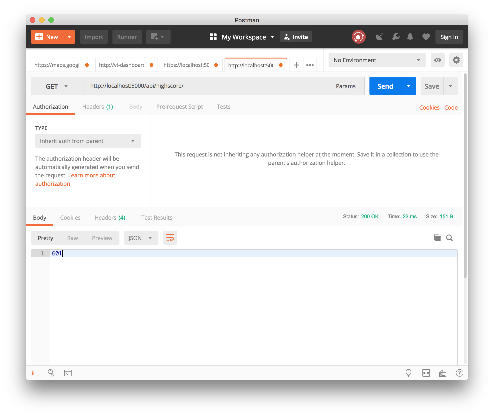
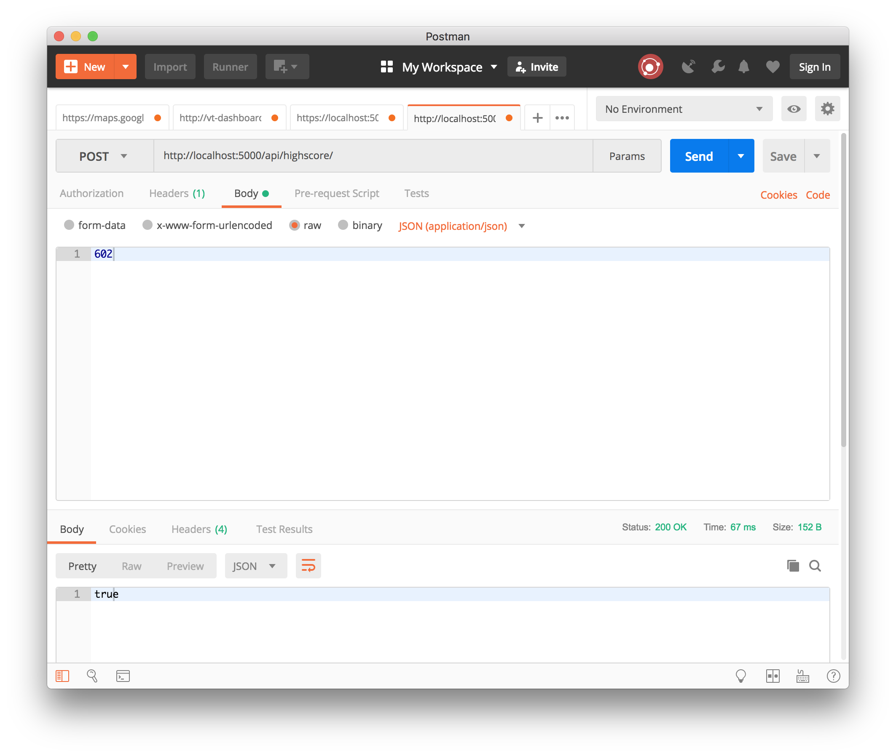

# Workshop Tromsø 20.09.2018

An ASP.net Web app running in containers orchestrated by Docker Compose. In this workshop, all commands are run from the root folder of project unless otherwise noted.

We have prepared Git branches with solutions for each part - they are written out in bold text, e.g.
#### `git checkout start`

## Prerequisites

- Install `git`
- Install the latest version of `.Net Core`.
- Install the latest version of `Docker`.
- Install `Visual Studio Code`.
- Run `docker run --rm microsoft/dotnet:2.1-sdk-alpine`.
- Run `docker run --rm microsoft/dotnet:2.1-aspnetcore-runtime-alpine`.
- Install postman.

## Part 1: Anatomy of an ASP.Net Web App
#### `git checkout start`

In this part you will create a simple ASP.Net web app and web API, familiarising yourself with their architectures.

### Create app from template

- `mkdir Workshop`
- `cd Workshop`
- `dotnet new mvc --no-https`

### Use Visual Studio Code to develop and debug

- `code .`

- When Visual Studio Code asks if you want to add "required assets to build and debug", press *yes*.
- `Ctrl + Shift + B` to build (`Shift + ⌘ + B` on a Mac)
- `F5` to debug
- You should see the default ASP.Net website template running in your browser.

### Get to know ASP.Net

- [Static resources](https://docs.microsoft.com/en-us/aspnet/core/fundamentals/static-files?view=aspnetcore-2.1&tabs=aspnetcore2x)
- [Model View Controller](https://docs.microsoft.com/en-us/aspnet/core/mvc/overview?view=aspnetcore-2.1)
- [Dependency Injection](https://docs.microsoft.com/en-us/aspnet/core/fundamentals/dependency-injection?view=aspnetcore-2.1)
- [Configuration](https://docs.microsoft.com/en-us/aspnet/core/fundamentals/configuration/?view=aspnetcore-2.1)
- [Routes](https://docs.microsoft.com/en-us/aspnet/core/fundamentals/routing?view=aspnetcore-2.1)
- [Request pipeline](https://docs.microsoft.com/en-us/aspnet/core/fundamentals/middleware/?view=aspnetcore-2.1)

#### Solution: `git checkout part1-mvc-template`

### Implement an actual app
Now you'll add a simple 2048 game and high score services. 

#### Create HTML5 game

- Add the content of the `Game` folder to your `wwwroot` folder.
- Verify that the game runs on [http://localhost:5000/Game.html](http://localhost:5000/Game.html).

#### Link game from example site

- Add `<li><a href="Game.html">Game</a></li>` to `views/Shared/_Layout.cshtml`.
- Verify that the game can be opened from the menu 

#### Solution: `git checkout part1-add-game`

#### Create High Score service

- Create a directory called `Services`
- In it, create the interface of a simple high score service, `IHighScoreService.cs`.
- Implement it in a new file called `HighScoreService.cs` in the same directory.
- Add it as a singleton to the service collection in `Startup.cs`
- Create `HighScoreController`. Check that it works by visiting [http://localhost:5000/api/highscore](http://localhost:5000/api/highscore) (You might need to restart the server).
- Verify the value is 0, posting a high score of 1 using _Postman_ and content type JSON, and verifying that the new high score is indeed one.

#### Solution: `git checkout part1-highscore-service`

#### Integrate High Score service

- Create a new JS class in `high_score_manager.js` in `wwwroot/js`
- The class should have a `setHighScore` and a `getHighScore` method which should use your highscore service to get and update the highscore
- Add this file to `Game.html`'s script imports.
- Add `HighScoreManager` to `application.js`.
- Use the `HighScoreManager` in `game_manager.js`.
- Verify that `scores/highScore.json` is written to disk in the _bin-folder_.

#### Solution: `git checkout part1-highscore-integration`

## Part 2: Local machine ain't good enough

Now we'll host the webapp in a Docker container

### First Docker try

- Update `Program.cs` and add `.UseUrls("http://*:5000")`.
- Create a `Dockerfile` to build and then contain the application
- Create a `.dockerignore` file to copy the minimum needed files to the build context
- Run `docker build -t dips/workshop .` to build the Docker image. The `-t` switch tells Docker to associate the *tag* `dips/workshop` with the newly built image. 
- Run `docker run -p 5000:5000 dips/workshop` to start the new container with our app. The `-p` switch tells Docker to connect one of our computers's (the *host*) network ports to one on our new container.
- Verify that the app works in the browser.
- By default, Docker containers will run in the background even if we interrupt them with Ctrl+C - `docker ps` gives us a list of the currently running containers, and `docker kill <id>` can shut down a container. 

### Adding mounting to preserve high score

- Run `docker run -p 5000:5000 -v <Path-To-Project>/scores:/app/scores dips/workshop`
- For Windows, you need to enable drive sharing in Docker settings. If you're using Docker Toolbox on Windows, this path has to be inside `C:\Users`.

#### Solution: `git checkout part2-containerize`

## Part 3: Divide and conquer

We don't want the website and API in the same app. Let's fix this.

### Create a new folder for the web project

- Create a new folder called `web` in the root folder.
- Move all files and folders to `web`, except `LICENSE` and `readme.md`.
- Recreate `.dockerignore` if it got lost in the moving process

#### Solution: `git checkout part3-move-app`

### Move high score to own app

- Create a new folder called `api` in the root folder.
- Navigate into the `api` folder and create a new app `dotnet new webapi --no-https`
- Open the project in VS Code `code .`
- Update `Program.cs` and add `.UseUrls("http://*:5000")`.
- Move `IHighScoreService`, `HighScoreService` and `HighScoreController` to the new app.
- Move `services.AddSingleton<IHighScoreService, HighScoreService>();` to the new `Startup`.
- Remove `using Workshop.Services;` from the original `Startup`.
- Verify that the new service works using Postman.

#### Solution: `git checkout part3-add-api`

### Create another Docker container

All commands here are called from the `api`-folder.

- Create a `Dockerfile` to build and then contain the application
- Create a `.dockerignore` file to copy the minimum needed files to the build context
- In `Startup.cs`, add `services.AddCors();` to `public void ConfigureServices(IServiceCollection services)` and `app.UseCors(builder => builder.WithOrigins("http://localhost"));` to `public void Configure(IApplicationBuilder app, IHostingEnvironment env)`.
- Run `docker build -t dips/api .` to build the docker image
- Run `docker run -p 5000:5000 -v <Path-To-Project>/scores:/app/scores dips/api` to run the app through the container
- Verify it works using Postman.

#### Solution: `git checkout part3-containerize`

### Make them work together

- Create a new file, `docker-compose.yml`, in the root folder.
- Navigate to the `web` folder and run `docker build -t dips/workshop .`
- Navigate back to the root folder and run `docker-compose up`.
- Enjoy your apps working together.

#### Solution: `git checkout part4-compose`

Congratulations! You now have a multi-container web application orchestrated by Docker Compose. Note how the app's concerns have been separated across the containers: so long as the API is available, our game doesn't care about *how* scores are stored. If we wanted, we could implement new high-score service backed by a proper database, and transparently replace the old service on-the-fly.

### Extra credit

- Right now, we have to manually set up CORS headers to allow the user to submit high scores, due to the [same-origin policy](https://developer.mozilla.org/en-US/docs/Web/Security/Same-origin_policy). A far better way of handling this is to set up a *reverse proxy* - like [Traefik](https://traefik.io/) or [Nginx](https://www.nginx.com/) - to handle user requests and pass them on to the correct container. Add a reverse proxy to your application to intercept requests to `api/highscore` and pass them to the `api` container.
- While Docker gives you command-line tools to manage running containers, they can get a bit hairy if you're running lots of applications with multiple containers. To make your life a bit easier, there are services which provide GUIs for container management, such as [Portainer](https://github.com/portainer/portainer). Extend your `docker-compose.yml` file with a Portainer service to manage the containers from your browser.
